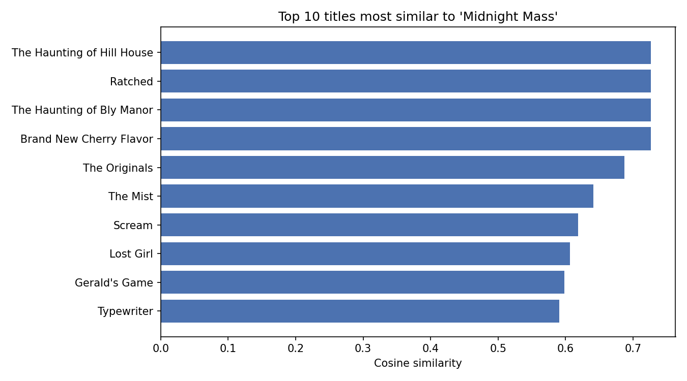

# Task 1 (Easy) — Netflix Content Recommendation System

**Author:** Muhammad Abdul Rafay — Auspify Technologies ML Intern

## Problem
Netflix has thousands of titles. When a viewer likes a show, how do we
automatically suggest other titles they are likely to enjoy, without any
user-rating history? This project builds a **content-based recommender**
that finds titles similar to a given title from the catalogue metadata
alone.

## Dataset
The Netflix titles dataset provided by Auspify Technologies
(`data/netflix_dataset.csv` in the parent folder): **8,790 rows** with
columns show_id, type, title, director, country, date_added,
release_year, rating, duration and listed_in. After removing 3 duplicated
titles, **8,787 unique titles** are indexed.

## Approach
1. Fill missing director / country / rating / genre values with "Unknown"
   and drop duplicated titles.
2. Build one text "profile" per title from **listed_in (genres), country,
   director, type and rating**. Names have spaces removed
   (e.g. `MikeFlanagan`) so TF-IDF treats a person as a single token.
3. Vectorise the profiles with **TF-IDF** (5,398 vocabulary terms).
4. Compute **cosine similarity** between titles.
5. `recommend(title, top_n=10)` looks the title up (case-insensitive),
   ranks every other title by similarity and returns the top 10 with
   their similarity scores.

## Real Results (from the actual run in this folder)
- TF-IDF matrix: **8,787 titles × 5,398 features**
- For **"Midnight Mass"** the top recommendations were *The Haunting of
  Hill House*, *Ratched* and *The Haunting of Bly Manor* (all similarity
  **0.7267**) — all US TV-MA horror/drama series, two of them also by
  Mike Flanagan, which confirms the recommender picks up director +
  genre signals correctly.
- For **"Ganglands"** the top pick was *Sentinelle* (**0.7528**),
  followed by *Crime Time* and *Lupin* — French crime/action titles.
- For **"The Great British Baking Show"** all top 10 picks were British
  reality TV shows (top similarity **0.6346**).

Full example outputs: `recommendations_example.txt` ·
Similarity chart: `recommendations_plot.png` · Raw run log: `run_output.txt`

## Screenshots


## How to Run
```bash
pip install -r ../../requirements.txt   # from the Auspify_Projects folder
python recommendation_system.py
```
The dataset is read from `../../data/netflix_dataset.csv` relative to
this folder (i.e. `auspify-projects/data/`).

## Files
- `recommendation_system.py` — main script (recommender class + examples)
- `recommendations_example.txt` — top-10 lists for 3 example titles
- `recommendations_plot.png` — similarity bar chart (submission screenshot)
- `results.json`, `run_output.txt` — machine-readable results and run log

---
Muhammad Abdul Rafay — Auspify Technologies ML Intern
