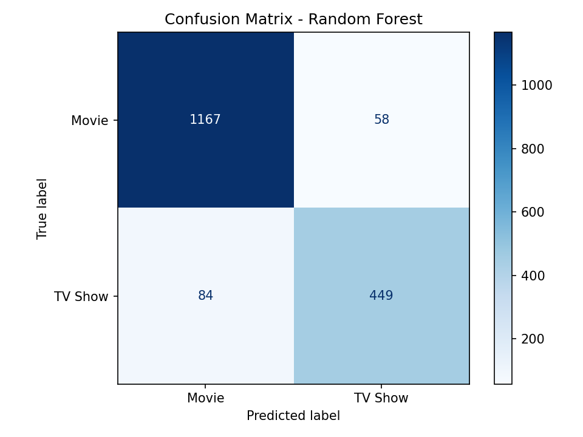
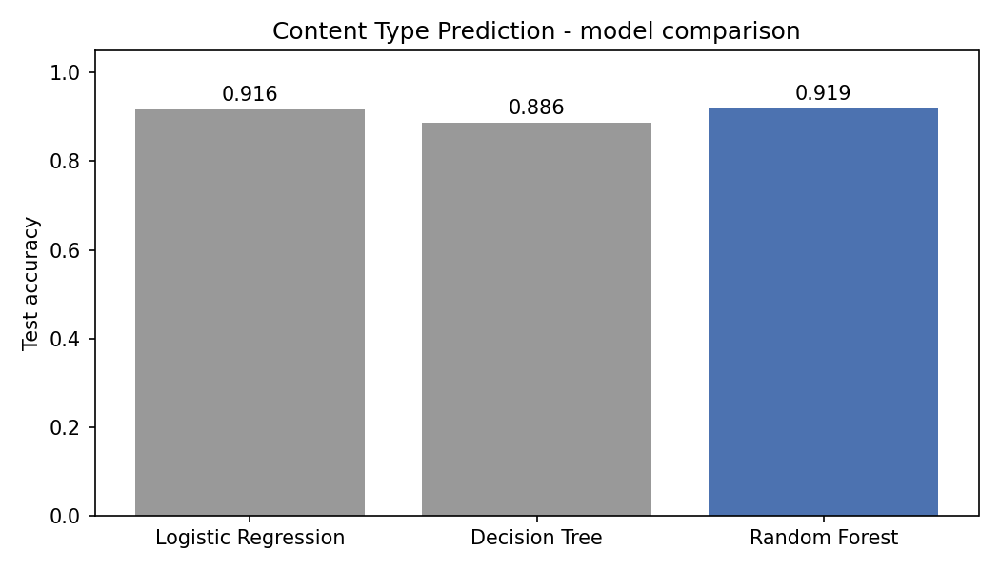

# Task 2 (Easy) — Netflix Content Type Prediction Model

**Author:** Muhammad Abdul Rafay — ML Intern

## Problem
Given only the descriptive information of a Netflix catalogue entry,
predict whether it is a **Movie** or a **TV Show** — a binary
classification problem.

## Dataset
The Netflix titles dataset:
**8,790 rows** (6,126 Movies / 2,664 TV Shows). Split 80/20 with
stratification: 7,032 train / 1,758 test rows.

## Approach
Features engineered from the raw columns:
- **Numeric:** release_year, year/month the title was added to Netflix,
  whether a director is credited, number of words in the title,
  number of genres listed.
- **Categorical (one-hot):** rating grouped into a maturity band,
  genre *theme* of the first listed genre, main country (top 10,
  rest = "Other").

**Leakage control (important):** three raw columns would hand the model
the answer, so they were neutralised:
- `duration` ("90 min" vs "2 Seasons") — excluded completely.
- `listed_in` literally contains "TV Dramas" vs "…Movies" — reduced to
  the genre theme only (Drama, Comedy, Crime, …).
- `rating` ("TV-MA" vs "R") — grouped into Kids / Family / Teens / Adult.

A first version without these fixes scored a meaningless 100%, which is
exactly why leakage checks matter. Three classifiers were then trained
in identical preprocessing pipelines: Logistic Regression, Decision
Tree and Random Forest.

## Real Results (test set, 1,758 titles — from the actual run)
| Model | Accuracy |
|---|---|
| Logistic Regression | 0.9158 |
| Decision Tree | 0.8862 |
| **Random Forest (best)** | **0.9192** |

Best model detail (Random Forest): Movie precision 0.93 / recall 0.95;
TV Show precision 0.89 / recall 0.84. TV Shows are the harder class —
they are the minority (30%) and overlap with movies on most features.

## Screenshots



Full per-model classification reports: `run_output.txt` ·
Numbers: `results.json`

## How to Run
```bash
pip install -r ../../requirements.txt
python content_type_prediction.py
```

## Files
- `content_type_prediction.py` — main script
- `confusion_matrix.png` — best-model confusion matrix (screenshot)
- `model_comparison.png` — accuracy comparison chart (screenshot)
- `results.json`, `run_output.txt` — results and full run log

---
Muhammad Abdul Rafay — ML Intern
