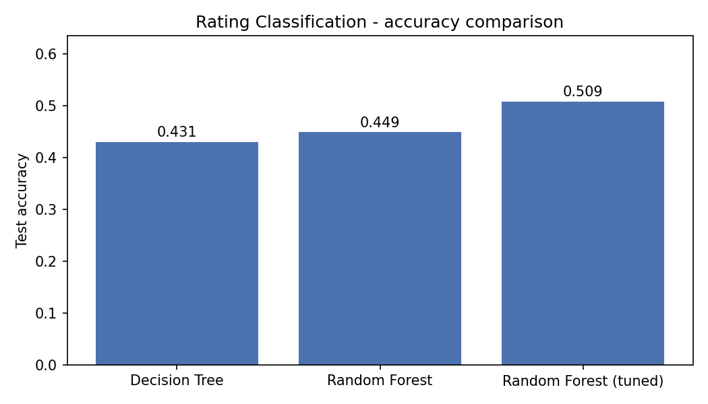
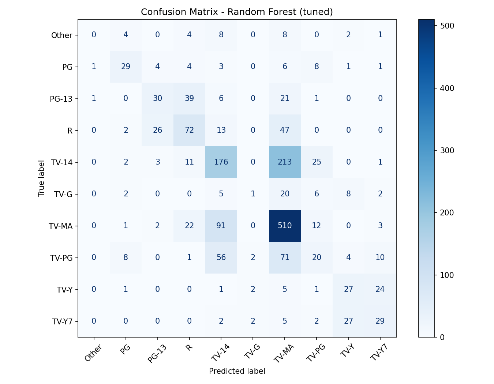

# Task 3 (Medium) — Netflix Audience Rating Classification

**Author:** Muhammad Abdul Rafay — Auspify Technologies ML Intern

## Problem
Predict a title's **audience rating** (TV-MA, TV-14, TV-PG, R, PG-13,
TV-Y7, …) from its catalogue features — a multi-class classification
problem. If ratings can be predicted reliably, missing or inconsistent
ratings in a catalogue can be flagged automatically.

## Dataset
The Netflix titles dataset provided by Auspify Technologies:
**8,790 rows, all 8,790 with a usable rating**. Ratings appearing fewer
than 100 times (NC-17, TV-Y7-FV, UR) were merged into an **"Other"**
class, giving **10 classes**: TV-MA (3,205), TV-14 (2,157), TV-PG (861),
R (799), PG-13 (490), TV-Y7 (333), TV-Y (306), PG (287), TV-G (220),
Other (132). Split 80/20 stratified: 7,032 train / 1,758 test.

## Approach
Features: type, release year, parsed duration value + unit
(minutes vs seasons), main genre, main country (top 10, rest = "Other"),
whether a director is credited, and content age. Categoricals are
one-hot encoded inside a scikit-learn pipeline.

Models compared:
1. **Decision Tree**
2. **Random Forest** (300 trees)
3. **Random Forest (tuned)** — GridSearchCV (3-fold) over
   n_estimators {200, 400}, max_depth {None, 20},
   min_samples_leaf {1, 2}. Best parameters found:
   `max_depth=20, min_samples_leaf=2, n_estimators=200`.

## Real Results (test set — from the actual run)
| Model | Accuracy |
|---|---|
| Decision Tree | 0.4306 |
| Random Forest | 0.4494 |
| **Random Forest (tuned, best)** | **0.5085** |

Honest interpretation: with 10 classes, the tuned forest's **50.85%**
is well above the majority-class baseline (~36.5%, always predicting
TV-MA), and tuning added +5.9 points over the plain forest. Per-class
detail (see `classification_report.txt`): TV-MA is recognised best
(F1 0.66, recall 0.80), while neighbouring bands are often confused —
e.g. TV-PG (F1 0.16) and TV-G (F1 0.04) blur into TV-14 / TV-Y7, and the
small "Other" class is never predicted. That is expected: a rating is a
human content judgement, and metadata alone only partly determines it.

## Screenshots



Full classification report: `classification_report.txt` ·
Numbers: `results.json` · Full run log: `run_output.txt`

## How to Run
```bash
pip install -r ../../requirements.txt
python rating_classification.py
```
Note: the grid-search step makes this script take ~2–3 minutes.

## Files
- `rating_classification.py` — main script
- `accuracy_comparison.png`, `confusion_matrix.png` — screenshots
- `classification_report.txt`, `results.json`, `run_output.txt`

---
Muhammad Abdul Rafay — Auspify Technologies ML Intern
