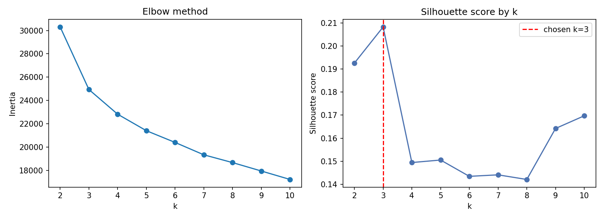
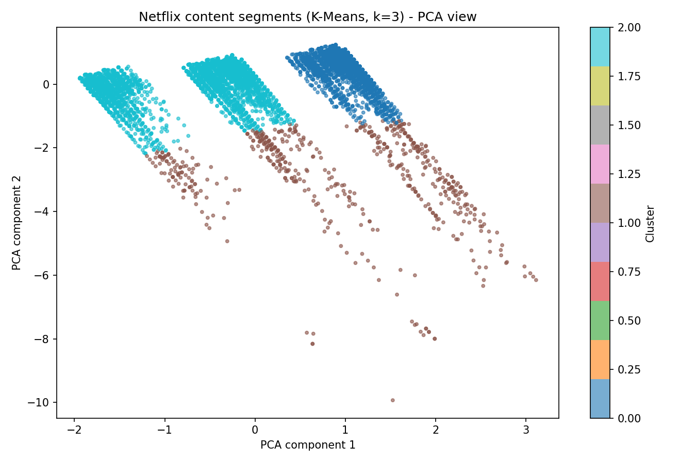

# Task 4 (Medium) — Netflix Content Segmentation (K-Means Clustering)

**Author:** Muhammad Abdul Rafay — Auspify Technologies ML Intern

## Problem
Group the Netflix catalogue into **content segments** without using any
label, so the catalogue can be understood (and marketed / recommended)
by segment rather than title by title. This is an unsupervised
**K-Means clustering** task.

## Dataset
The Netflix titles dataset provided by Auspify Technologies:
all **8,790 rows** are clustered.

## Approach
1. **Features (33 after encoding):** release year and number of genres
   (numeric, standardised), plus one-hot encoded maturity band
   (Kids / Family / Teens / Adult, grouped from the rating), genre
   *theme* of the first listed genre (Drama, Comedy, Crime, … — with
   the "TV"/"Movies" wording removed), and main country (top 6,
   rest = "Other").
2. **Format features excluded on purpose:** a first run that included
   the Movie/TV flag and raw duration only re-discovered "movies vs
   TV shows" (k=2) — already known, and not a content segment.
   Those columns are used afterwards only to *describe* the clusters.
3. **Choosing k:** K-Means was run for k = 2–10. Inertia (elbow) falls
   steadily with no sharp bend, so the **silhouette score** decided:
   k = 3 scored highest (0.2082).
4. Final K-Means (k = 3, n_init = 10) on all 8,790 titles, visualised
   with a **2-D PCA projection**.

## Real Results (from the actual run)
Silhouette by k: k=2 → 0.1926 · **k=3 → 0.2082 (chosen)** · k=4 → 0.1495 ·
k=5 → 0.1505 · k=6 → 0.1435 · k=7 → 0.1441 · k=8 → 0.1421 · k=9 → 0.1642 ·
k=10 → 0.1697. (Scores are modest, as expected for mostly-categorical
content features — the segments overlap rather than separate cleanly.)

### Cluster interpretation
- **Cluster 0 — Modern international adult content (3,458 titles):**
  62% movies, average release year 2016, adult maturity, drama-led,
  and dominated by countries outside the top-6 list — this is Netflix's
  large non-US / international catalogue.
- **Cluster 1 — Older US catalogue (589 titles):** 91% movies, average
  release year **1988**, US-produced, action-led, teens maturity band —
  the classic / older back-catalogue, clearly separated by release year.
- **Cluster 2 — Modern US adult content (4,743 titles):** the largest
  segment — 73% movies, average release year 2016, US-produced, adult
  dramas at its centre. This is the mainstream core of the catalogue.

Machine-generated profile: `cluster_profile.csv` ·
Interpretation file: `cluster_interpretation.txt`

## Screenshots



## How to Run
```bash
pip install -r ../../requirements.txt
python content_segmentation.py
```

## Files
- `content_segmentation.py` — main script
- `cluster_visualisation.png` — PCA 2-D cluster plot (screenshot)
- `elbow_and_silhouette.png` — k-selection chart (screenshot)
- `cluster_profile.csv`, `cluster_interpretation.txt`,
  `results.json`, `run_output.txt`

---
Muhammad Abdul Rafay — Auspify Technologies ML Intern
